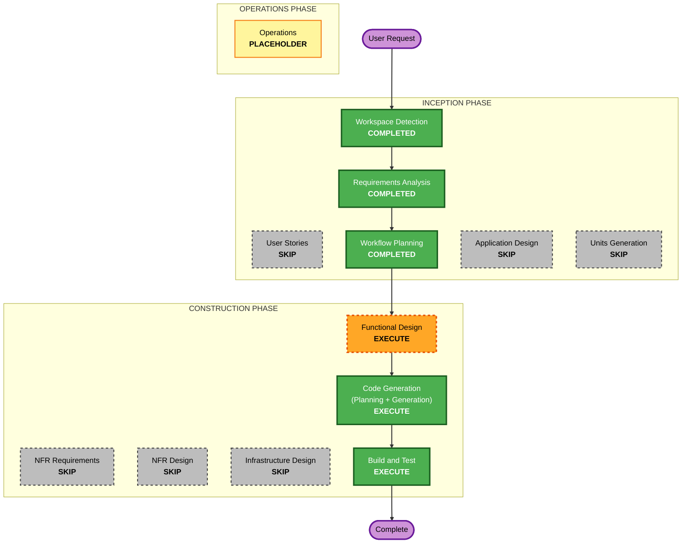

# Execution Plan — Net-Worth Snapshot

## Detailed Analysis Summary

### Transformation Scope (Brownfield)
- **Transformation Type**: Single component (additive feature) within existing monolith.
- **Primary Changes**: New `net_worth` domain concept — snapshot + line-item tables, metric compute, API endpoints, web UI page.
- **Related Components**: `portfolio/models.py` (new tables), Alembic migration, `api/main.py` (new routes), `web/` (new page), reuse `fx_rate` + `/api/overview` live value.

### Change Impact Assessment
- **User-facing changes**: Yes — new net-worth page in web UI.
- **Structural changes**: No — additive; existing schema untouched.
- **Data model changes**: Yes — new tables `nw_snapshot`, `nw_item` (+ seed catalogue).
- **API changes**: Yes — new endpoints (list/create/get snapshot, item catalogue). Existing endpoints untouched.
- **NFR impact**: No — reuses existing stack, FX, Decimal money types.

### Component Relationships
- **Primary Component**: new `portfolio/networth.py` (compute) + models.
- **Shared Components**: `fx_rate` table, `portfolio/db.py`, `/api/overview` live portfolio value.
- **Dependent Components**: `api/main.py`, `web/` UI.
- **Change scope**: Minor (additive, no breaking changes).

### Risk Assessment
- **Risk Level**: Low — isolated, additive, easy rollback (drop new tables/routes).
- **Rollback Complexity**: Easy.
- **Testing Complexity**: Simple — metric math unit tests + FX conversion.

## Workflow Visualization

## Phases to Execute

### 🔵 INCEPTION PHASE
- [x] Workspace Detection (COMPLETED)
- [x] Reverse Engineering (SKIPPED — relevant subsystems already mapped; scoped additive feature)
- [x] Requirements Analysis (COMPLETED)
- [x] User Stories (SKIPPED — single user, clear scope, no multi-persona)
- [x] Execution Plan (IN PROGRESS)
- [ ] Application Design - SKIP
  - **Rationale**: Single new module following existing patterns; component methods/business rules folded into Functional Design.
- [ ] Units Generation - SKIP
  - **Rationale**: One cohesive unit ("networth"); no decomposition needed.

### 🟢 CONSTRUCTION PHASE
- [ ] Functional Design - EXECUTE
  - **Rationale**: New data models (snapshot + items, seed catalogue) and precise metric math (6 metrics, FX conversion, live-value freeze) need design before coding.
- [ ] NFR Requirements - SKIP
  - **Rationale**: Reuses existing stack; no perf/security/scale requirements (security extension disabled).
- [ ] NFR Design - SKIP
  - **Rationale**: NFR Requirements skipped.
- [ ] Infrastructure Design - SKIP
  - **Rationale**: No infra changes; same Postgres + FastAPI + static web.
- [ ] Code Generation - EXECUTE (ALWAYS)
  - **Rationale**: Models, migration, compute, API, UI, tests.
- [ ] Build and Test - EXECUTE (ALWAYS)
  - **Rationale**: Migration applies, metric math verified, endpoint/UI smoke test.

### 🟡 OPERATIONS PHASE
- [ ] Operations - PLACEHOLDER

## Unit of Work
- **Single unit**: `networth` — models + migration + compute + API + UI + tests.

## Success Criteria
- **Primary Goal**: Maintain dated asset/liability snapshots and report 6 net-worth metrics combining live portfolio value.
- **Key Deliverables**: `nw_snapshot`/`nw_item` tables + seed, `portfolio/networth.py` compute, API endpoints, web net-worth page, unit tests.
- **Quality Gates**: Migration up/down clean; metric math matches definitions; FX conversion correct; live value frozen on snapshot; UI renders summary.
